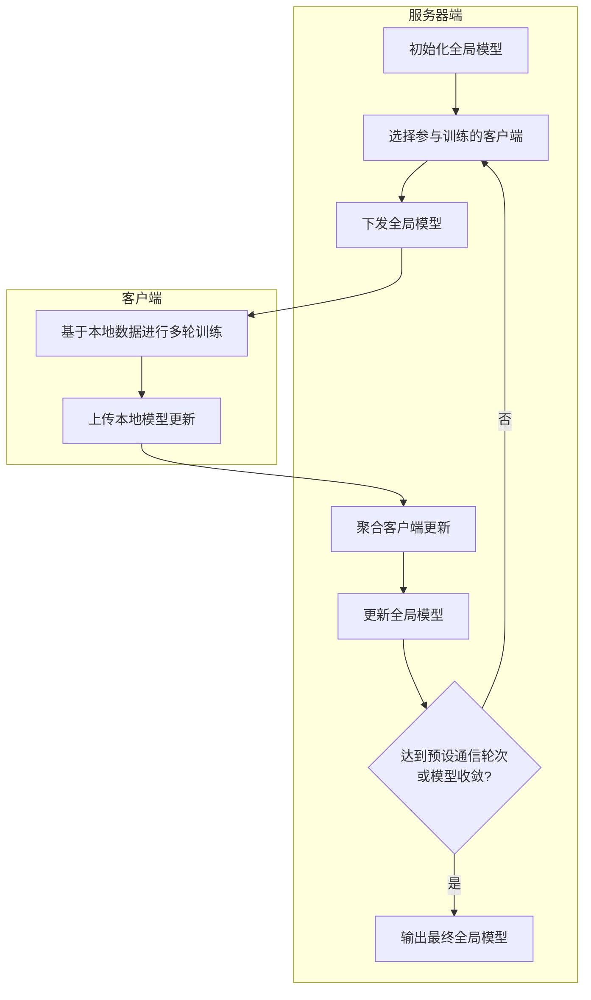

```mermaid
flowchart TD
    subgraph S[服务器端]
        A[初始化全局模型]
        B[选择参与训练的客户端]
        C[下发全局模型]
        F[聚合客户端更新]
        G[更新全局模型]
        H{达到预设通信轮次<br/>或模型收敛?}
        I[输出最终全局模型]
    end

    subgraph U[客户端]
        D[基于本地数据进行多轮训练]
        E[上传本地模型更新]
    end

    A --> B
    B --> C
    C --> D
    D --> E
    E --> F
    F --> G
    G --> H
    H -- 否 --> B
    H -- 是 --> I
```