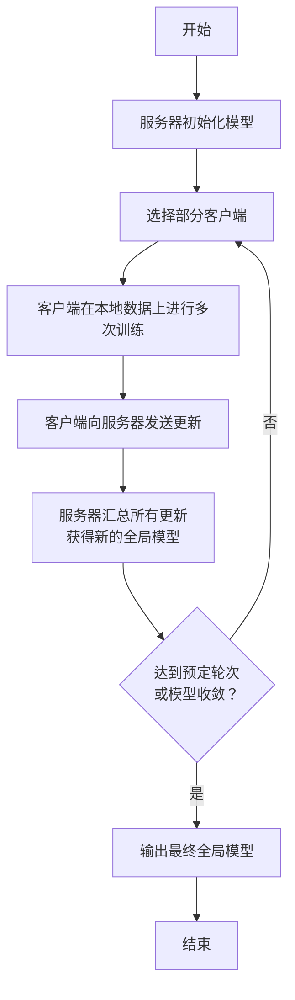

```mermaid
flowchart TD
    A[开始] --> B[服务器初始化模型]
    B --> C[选择部分客户端]
    C --> D[客户端在本地数据上进行多次训练]
    D --> E[客户端向服务器发送更新]
    E --> F[服务器汇总所有更新\n获得新的全局模型]
    F --> G{达到预定轮次\n或模型收敛？}
    G -- 否 --> C
    G -- 是 --> H[输出最终全局模型]
    H --> I[结束]
  
```